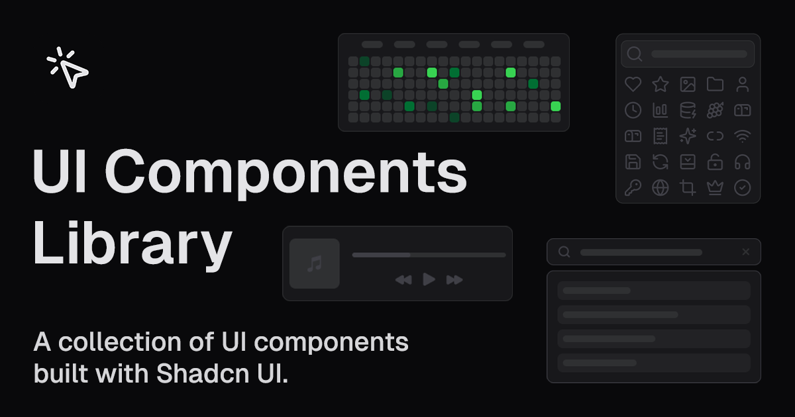

This is a collection of UI components built with Shadcn UI, featuring customizable Icon Picker and Github Contributions components.

## Features

### Icon Picker Components

Comprehensive icon picker components with search functionality, supporting single/multiple selection, custom colors, and various virtualization implementations for optimal performance. Available in basic, popover, and virtualized variants.

[View Icon Picker Examples →](https://ui.raulcarini.dev/icon-picker)

### Github Contributions Components

Interactive GitHub-style contribution calendar components that visualize activity data in a heatmap grid. Features basic and advanced variants with optional client-side data fetching capabilities.

[View Github Contributions Examples →](https://ui.raulcarini.dev/github-contributions)

### Music Player Components

Fully-featured music player components with essential playback controls, progress tracking, and modern UI designs. Available in generic, Spotify-inspired, and Apple Music-inspired variants.

[View Music Player Examples →](https://ui.raulcarini.dev/music-player)

### Search Bar Components

URL query-aware search components with client-side state management. Features basic search functionality and advanced autosuggestion capabilities using Nuqs for URL synchronization.

[View Search Bar Examples →](https://ui.raulcarini.dev/search-bar)

### Rating Group Components

Interactive rating components for collecting user feedback with star-based interfaces. Supports basic and advanced configurations including half-ratings, read-only modes, and custom icons.

[View Rating Group Examples →](https://ui.raulcarini.dev/rating-group)

### Theme Switch Components

Theme switching components for toggling between light and dark modes with smooth transitions. Available as button and toggle switch variants with next-themes integration.

[View Theme Switch Examples →](https://ui.raulcarini.dev/theme-switch)

## Technologies

- Next.js (App Router) v15
- React v19
- TypeScript
- Tailwind CSS v4
- Shadcn UI
- Lucide React (for icons)

## Getting Started

### Prerequisites

- Node.js
- pnpm or npm or yarn

### Installation

Clone the repository then install dependencies:

```bash
git clone https://github.com/r4ultv/ui
cd ui
pnpm install
```

### Running the Development Server

```bash
pnpm run dev
```

Open [http://localhost:3000](http://localhost:3000) with your browser to see the result.

## Component Usage

### Registry Configuration

Before adding components to your project, configure the registry in your `components.json`:

```json
{
  "registries": {
    "@ui": "https://ui.raulcarini.dev/r/{name}.json"
  }
}
```

### Adding Components via Registry

Once the registry is configured, you can add any variant using shadcn/cli with the namespace format:

```bash
pnpx shadcn@latest add @ui/icon-picker
pnpx shadcn@latest add @ui/github-contributions
pnpx shadcn@latest add @ui/music-player
pnpx shadcn@latest add @ui/search-bar
pnpx shadcn@latest add @ui/rating-group
pnpx shadcn@latest add @ui/theme-switch
```

Or you can still use the direct URL format:

```bash
pnpx shadcn@latest add https://ui.raulcarini.dev/r/icon-picker.json
pnpx shadcn@latest add https://ui.raulcarini.dev/r/github-contributions.json
pnpx shadcn@latest add https://ui.raulcarini.dev/r/music-player.json
pnpx shadcn@latest add https://ui.raulcarini.dev/r/search-bar.json
pnpx shadcn@latest add https://ui.raulcarini.dev/r/rating-group.json
pnpx shadcn@latest add https://ui.raulcarini.dev/r/theme-switch.json
```

Check the examples below for an overview of how to integrate each variant:

> NOTE: For optimal performance and to reduce initial bundle size, it is recommended to use dynamic import.

```tsx
const IconPicker = dynamic(() => import("@/components/icon-picker"));
```

### Basic Icon Picker

```tsx
import IconPicker from "@/components/icon-picker";

function MyComponent() {
  const [selectedIcon, setSelectedIcon] = React.useState<string | null>(null);
  return (
    <IconPicker selectedIcon={selectedIcon} setSelectedIcon={setSelectedIcon} />
  );
}
```

### Github Contributions

```tsx
import GithubContributions from "@/components/github-contributions";

function MyComponent() {
  // Example data - replace with your actual contribution data
  const dummyData = [
    // ... your contribution data array here
    { date: "2023-10-26", count: 1, level: 1 },
    { date: "2023-10-27", count: 3, level: 3 },
    { date: "2023-10-28", count: 0, level: 0 },
    // ... more data
  ];

  return <GithubContributions data={dummyData} />;
}
```

### Music Player

```tsx
import MusicPlayer from "@/components/music-player";

function MyComponent() {
  return (
    <MusicPlayer
      song={{
        name: "Bean (Kobe) [feat. Chief Keef]",
        artists: ["Lil Uzi Vert", "Chief Keef"],
        album: {
          name: "Eternal Atake (Deluxe) - LUV vs. The World 2",
          image:
            "https://i.scdn.co/image/ab67616d00001e02bd5f03953f9f1d3b833369c0",
        },
        duration: 238,
      }}
    />
  );
}
```

### Search Bar

```tsx
import { NuqsAdapter } from "nuqs/adapters/next/app";
import SearchBar from "@/components/search-bar";

function MyComponent() {
  return (
    <NuqsAdapter>
      <SearchBar />
    </NuqsAdapter>
  );
}
```

### Rating Group

```tsx
import RatingGroup from "@/components/rating-group";

function MyComponent() {
  const [rating, setRating] = React.useState<number>(0);
  return (
    <RatingGroup
      value={rating}
      onValueChange={setRating}
      maxRating={5}
    />
  );
}
```

### Theme Switch

```tsx
import ThemeSwitch from "@/components/theme-switch";

function MyComponent() {
  return <ThemeSwitch />;
}
```

## License

This project is licensed under the MIT License - see the [LICENSE](LICENSE) file for details.

## Acknowledgments

- [Shadcn UI](https://ui.shadcn.com/)
- [Lucide React](https://lucide.dev/)
- [Virtua](https://github.com/inokawa/virtua)
- [Tanstack Virtual](https://tanstack.com/virtual/latest)
- [React Virtualized](https://github.com/bvaughn/react-virtualized)
- [Github Contributions API](https://github.com/grubersjoe/github-contributions-api)
- [Nuqs](https://nuqs.47ng.com/)
